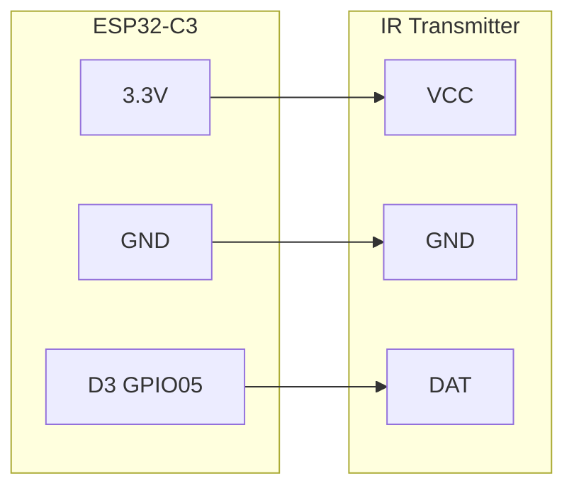

# ESPHome Woozoo Fan IR Controller
This guide details how to control the Woozoo Fan (Model PCF-SC15T-CT) using an ESP32-C3 and an IR transmitter with Home Assistant.

Inspired by: https://randomblock1.com/blog/smartifying-dumb-fan. While much of the process followed the blog’s instructions, I discovered that my fan uses different NEC commands.

## Initial Setup
I connected an IR receiver to capture the NEC codes for all buttons and updated the ESPHome YAML file accordingly.

```yaml
button:
  - platform: template
    name: "Woozoo Fan Toggle"
    on_press:
      remote_transmitter.transmit_nec:
        address: 0xDE80
        command: 0xFF00
  - platform: template
    name: "Woozoo Fan Timer 1 Hour"
    on_press:
      remote_transmitter.transmit_nec:
        address: 0xDE80
        command: 0xF708
  - platform: template
    name: "Woozoo Fan Timer 2 Hour"
    on_press:
      remote_transmitter.transmit_nec:
        address: 0xDE80
        command: 0xF30C
  - platform: template
    name: "Woozoo Fan Timer 4 Hour"
    on_press:
      remote_transmitter.transmit_nec:
        address: 0xDE80
        command: 0xEF10
  - platform: template
    name: "Woozoo Fan Breeze Mode"
    on_press:
      remote_transmitter.transmit_nec:
        address: 0xDE80
        command: 0xF609
  - platform: template
    name: "Woozoo Decrease Fan Speed"
    on_press:
      remote_transmitter.transmit_nec:
        address: 0xDE80
        command: 0xEB14
  - platform: template
    name: "Woozoo Increase Fan Speed"
    on_press:
      remote_transmitter.transmit_nec:
        address: 0xDE80
        command: 0xE916
  
  - platform: template
    name: "Woozoo Fan Vertical Oscillation"
    on_press:
      remote_transmitter.transmit_nec:
        address: 0xDE80
        command: 0xF10E
  - platform: template
    name: "Woozoo Fan Horizontal Oscillation"
    on_press:
      remote_transmitter.transmit_nec:
        address: 0xDE80
        command: 0xF50A
  - platform: template
    name: "Woozoo Fan Led Toggle"
    on_press:
      remote_transmitter.transmit_nec:
        address: 0xDE80
        command: 0xF20D
  - platform: template
    name: "Woozoo Fan Led Toggle"
    on_press:
      remote_transmitter.transmit_nec:
        address: 0xDE80
        command: 0xEE11
```

## Hardware
1. ESP32-c3 (coudld be any esp device but I had these handy)
   
   

2. IR transciever [Amazon](https://www.amazon.com/Digital-Receiver-Transmitter-Electronic-Building/dp/B08X2MFS6S/ref=sr_1_3?crid=NBAN84L0YMCV&dib=eyJ2IjoiMSJ9.7mNRqw4QxbaRUUFacR4SxGKvZNVlztMBJDRO8L9E9ILIc71ee7ZIMg-HJLmxF3vnm_vhY1opII7j0yKutYAwoKFqolvotVV8R3HCE7j4OHVkjP2NX6_qt3f36Qlxebmf6BqNnKKbWApQ3uXGK0QzXfhd4tbZNa1XUpeBDLcZqJqQDFd1y56Qvu3LgnjMMS40vsAciO6T8XjU_hU8DwTSGYTA-YQ8WX-Do765uqisbCM.NObrKUdwbcAsXzgrHvJ1wxpeNUilVVwRpU3_4fDT4Bg&dib_tag=se&keywords=ir%2Btransmitter%2Band%2Breceiver&qid=1729058616&sprefix=ir%2Btrans%2Caps%2C232&sr=8-3&th=1)
   
   

## Wiring



